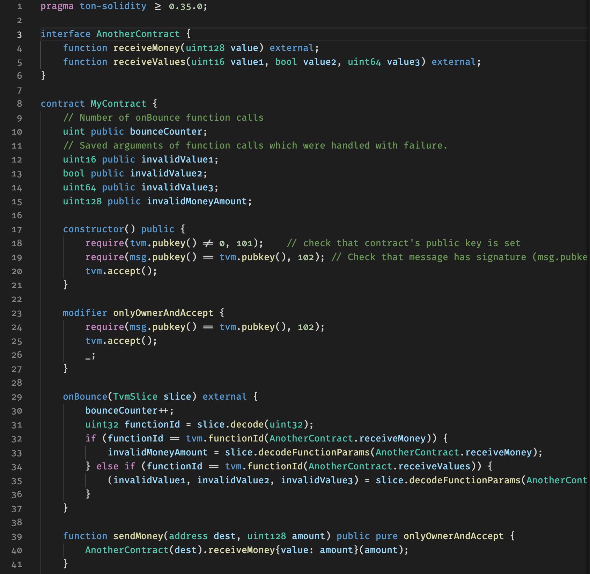
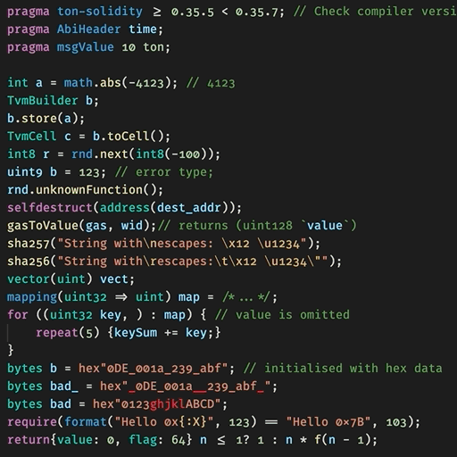

# FreeTON Solidity syntax README

Visual Studio Code Syntax highlighter for FreeTON Solidity.

## Features

Extension supports two file extensions: `.sol` and `.solt`. You can rename your files to `.solt` to avoid conflict with original Solidity highlighter. Or you can choose "Solidity (FreeTON) (solidityft)" highlighter in editor (per file).

The extension supports all FreeTON syntax additions to Solidity language.

1. TON Units
2. TON specific types (`TvmCell`, `TvmSlice`, `TvmBuilder`, `ExtraCurrencyCollection`, `optional`)
3. TON specific control structures: Range-based `for` loop, `repeat`
4. Pragmas `ton-solidity`, `ignoreIntOverflow`, `AbiHeader`, `msgValue`
5. State variables keywords: `constant`, `static`, `public`
6. Special contract functions: receive, fallback, onBounce, onTickTock, onCodeUpgrade,afterSignatureCheck
7. Function specifiers: pure, view and default, inline, functionID(), externalMsg and internalMsg
8. Events and return options
9. Synchronous calls `.await`
10. `tvm`, `math` and `rnd` namespaces
11. FreeTON global functions
12. Fromatting helpers

Also it extends Solidity syntax highlighting.
1. Error highlighting in `hex""` literal
2. Escaped symbols highlighting in string: simple, hex, unicode
3. Highlight variable and other names in comments

See example files for demo.

The extension supports different themes.  
Please note: some themes provide not all colors, for example `tvm.accept()` call produces `support.function` grammar for substring `accept`, but some themes color it the same way as `entity.name.function`.

Here is a demo (wait for 5 seconds):

## Installation

The extension is not currently published, so it can be installed manually.

1. `git clone` or download and extract source code;
2. Copy source code folder to `~/.vscode/extensions/`;
3. Reload VSCode window (Ctrl+Shift+P and then Reload Window).
4. Check `Extensions` and enable extension if it is disabled.

## Release Notes

Users appreciate release notes as you update your extension.

### 1.0.0

Initial release.

## Note
The syntax file created by [Juan Blanco](https://github.com/juanfranblanco/vscode-solidity/blob/672c124c995818f6276ce201f8c7659ed87ea777/syntaxes/solidity.json) was used as the basis of Solidity language highlighter. See [License](./License.txt) for copyrights.
